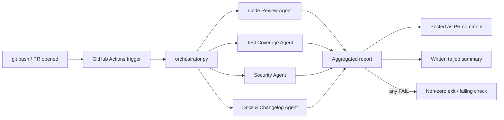
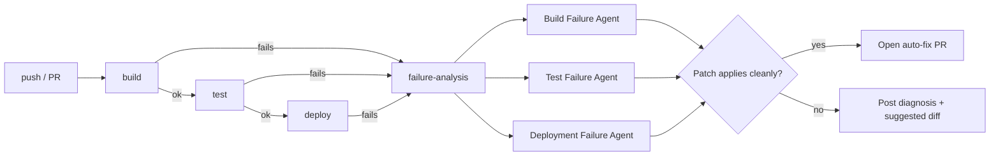

# Multi-Agent Outer-Loop Pipeline

A CI/CD pipeline with two cooperating agent groups:

1. **PR Review agents** (`.github/workflows/agent-pipeline.yml`) — five
   Claude agents review every pull request's diff in parallel (code review,
   test coverage, security, docs, **cost impact**) and post a combined
   comment, including the LLM spend of the run itself.
2. **Build/Test/Deploy + Failure Analysis agents**
   (`.github/workflows/ci-pipeline.yml`) — a real build → test → deploy
   pipeline. If any stage fails, three specialized Claude agents diagnose
   *why*, and attempt to open an auto-fix pull request with a patch.

This is an "outer loop" pipeline in the sense that everything runs *after*
code leaves your machine (on push/PR), as opposed to inner-loop tools that
run locally while you write code.

## Architecture



Each PR-review agent:
- Receives the same PR diff + list of changed files
- Has its own system prompt and area of focus
- Returns a `PASS` / `WARN` / `FAIL` verdict plus a short bullet-point summary

The orchestrator runs all five agents concurrently (`ThreadPoolExecutor`),
so wall-clock time is roughly one agent call, not five sequential ones.

### Cost Impact agent (LangChain) & LLM spend tracking

`CostImpactAgent` reviews the diff for **cloud/infra cost implications** —
new or upsized cloud resources, heavy new dependencies, N+1 or per-request
external calls that scale with traffic, unbounded loops/fetches, high-
frequency scheduled jobs, unbounded logging/storage growth. It's built with
**LangChain** (`ChatAnthropic`) rather than the raw Anthropic SDK the other
agents use, as a second orchestration path in the same pipeline.

Separately, every agent — LangChain or raw SDK — reports its own token
usage into a shared `CostTracker` (`common/cost_tracker.py`), which prices
each call against Anthropic's official per-model rate card and appends a
collapsible cost breakdown to the bottom of the PR comment:

```
💰 LLM cost for this run: $0.0193 (6,214 tokens across 5 calls)
| Agent | Model | Input tokens | Output tokens | Cost |
|---|---|---|---|---|
| Code Review | claude-sonnet-5 | 1,102 | 240 | $0.0046 |
| Test Coverage | claude-sonnet-5 | 980 | 190 | $0.0038 |
| Security | claude-sonnet-5 | 1,050 | 210 | $0.0041 |
| Docs & Changelog | claude-sonnet-5 | 890 | 175 | $0.0032 |
| Cost Impact | claude-sonnet-5 | 1,192 | 195 | $0.0036 |
```

The failure-analysis pipeline (`failure_orchestrator.py`) tracks and reports
the same way, so a failed build/test/deploy run shows what its own
diagnosis + auto-fix attempt cost.

Rates are hardcoded from [Anthropic's pricing page](https://platform.claude.com/docs/en/about-claude/pricing)
in `common/cost_tracker.py` — update `PRICING` if rates change (note:
Sonnet 5's introductory $2/$10 rate reverts to $3/$15 on September 1, 2026).

### Build / Test / Deploy + Failure Analysis



`ci-pipeline.yml` runs a real `build → test → deploy` chain against the
small demo app in `app/`. Whichever stage fails uploads its raw log as an
artifact. The `failure-analysis` job (which only runs `if: failure()`)
downloads whichever logs exist, and routes each to the matching agent:

| Log        | Agent                    | What it does |
|------------|---------------------------|--------------|
| `build.log`  | `BuildFailureAgent`       | Diagnoses dependency/compile/lint errors |
| `test.log`   | `TestFailureAgent`        | Diagnoses failing tests, decides app-code vs. test bug |
| `deploy.log` | `DeploymentFailureAgent`  | Diagnoses config/env/infra deploy errors |

Each agent returns a root cause, a plain-language fix explanation, and
(when it's confident) a unified diff patch. The orchestrator then:

1. Creates a branch (`agent-fix/<stage>-<sha>`) and tries `git apply` on the patch.
2. If it applies cleanly → commits, pushes, and opens a PR titled `🤖 Auto-fix: <stage> failure on <sha>`.
3. If it doesn't apply cleanly, or the agent wasn't confident → no branch is left behind; the suggested diff is posted as text instead.
4. Either way, a diagnostic report is posted as a **commit comment** and written to the job summary — so a failure is never silent, even when auto-fix isn't possible.

Auto-fix PRs are always meant to be reviewed, not blindly merged — the PR
body says so explicitly.

## The demo app & container

`app/` is a tiny FastAPI service wrapping `calculator.py`'s `add`/`divide`
functions, with a `/health` endpoint. It's what gets built into the
container image and smoke-tested by the `deploy` stage.

Build and run it locally:

```bash
docker build -t demo-app:local .
docker run --rm -p 8000:8000 demo-app:local
curl http://localhost:8000/health
curl "http://localhost:8000/add?a=2&b=3"
curl "http://localhost:8000/divide?a=10&b=0"   # -> 400, "Cannot divide by zero"
```

In `ci-pipeline.yml`:
- **build** runs `docker build`, then `docker save`s the image as an artifact
  (build stages run on separate runners, so the image has to travel between
  jobs as a `.tar` rather than staying in a local daemon).
- **test** runs `pytest` directly on the host (unit tests + API tests via
  FastAPI's `TestClient`) — fast, no container needed.
- **deploy** downloads and `docker load`s the image, runs it, and polls
  `/health` via `scripts/deploy.sh` — a real smoke test, not a simulated one.

To push to a real registry instead of just smoke-testing locally, add a
`docker push` step after `docker build` (with a login step using a registry
secret) — the rest of the pipeline doesn't need to change.

## Project layout

```
.
├── .github/workflows/
│   ├── agent-pipeline.yml       # PR review trigger
│   └── ci-pipeline.yml          # Build/test/deploy + failure-analysis trigger
├── Dockerfile                    # Container image for app/
├── orchestrator.py               # PR-review fan-out/aggregate/post
├── failure_orchestrator.py       # Failure diagnosis + auto-fix fan-out
├── agents/
│   ├── base_agent.py             # Shared interface + verdict/summary parser
│   ├── code_review_agent.py
│   ├── test_coverage_agent.py
│   ├── security_agent.py
│   ├── docs_agent.py
│   ├── cost_impact_agent.py      # LangChain-based — cloud/infra cost review
│   ├── failure_base_agent.py     # Shared interface for failure-diagnosis agents
│   ├── build_failure_agent.py
│   ├── test_failure_agent.py
│   └── deployment_failure_agent.py
├── common/
│   ├── claude_client.py          # Anthropic API wrapper (retries, model config, cost tracking)
│   ├── github_client.py          # GitHub REST helper (diffs, comments, PRs)
│   ├── git_ops.py                # Safe patch-apply + branch + push helper
│   └── cost_tracker.py           # Shared LLM spend tracker (raw SDK + LangChain agents)
├── app/
│   ├── main.py                   # FastAPI service (containerized)
│   ├── calculator.py             # Demo business logic
│   └── requirements.txt          # Minimal deps for the container image
├── tests/
│   ├── test_calculator.py
│   └── test_api.py
├── scripts/deploy.sh             # Runs the container, polls /health, tears down
└── requirements.txt               # Full deps for CI/agents (includes app/requirements.txt)
```

## Setup (to demo this on GitHub)

1. Push this folder's contents to a new GitHub repository.
2. In the repo, go to **Settings → Secrets and variables → Actions** and add:
   - `ANTHROPIC_API_KEY` — your Anthropic API key
   - (`GITHUB_TOKEN` is provided automatically by Actions — no setup needed)
3. Create a branch, make a small code change, and open a pull request against `main`.
4. Watch the **Actions** tab: the `Multi-Agent Outer Loop` workflow runs automatically.
5. Once it finishes, check the PR — you'll see a comment like:

   ```
   ## 🤖 Multi-Agent Review

   ### ✅ Code Review — PASS
   - No issues found in the changed logic.

   ### ⚠️ Test Coverage — WARN
   - `parse_config()` has no test covering malformed input.

   ### ✅ Security — PASS
   - No secrets or injection risks detected.

   ### ⚠️ Docs & Changelog — WARN
   - New `--verbose` flag is undocumented in README.
   - Suggested changelog line: "Add --verbose flag to CLI output."
   ```

The job also fails (non-zero exit) if any agent returns `FAIL`, so you can
optionally make this a required check to block merges on real issues.

## Demoing the failure-analysis + auto-fix path

Trigger each failure type intentionally to see the agents work:

- **Build failure**: break the `Dockerfile` (e.g. `COPY app/nonexistent.txt .`)
  or add a nonexistent package to `app/requirements.txt`, push.
- **Test failure**: change `add()` in `app/calculator.py` to return the wrong
  value (e.g. `a - b`), push — `tests/test_calculator.py` and
  `tests/test_api.py` will both fail against it.
- **Deploy failure**: go to **Settings → Secrets and variables → Actions →
  Variables**, add `FORCE_DEPLOY_FAILURE = true`. The next push will fail the
  container health check at the deploy stage without touching real infra.

After pushing, watch the **Actions** tab: `build`/`test`/`deploy` runs, the
failing one uploads its log, and `failure-analysis` runs automatically.
Check the **commit's** comments (not the PR) for the diagnosis, and the
**Pull requests** tab for an auto-fix PR if the agent produced a clean patch.

> **Note:** opening PRs from a workflow requires *"Allow GitHub Actions to
> create and approve pull requests"* to be enabled under **Settings →
> Actions → General → Workflow permissions**.

## Extending it

- **Add an agent**: subclass `BaseAgent`, set `name` + `system_prompt`, add it
  to `AGENT_CLASSES` in `orchestrator.py`.
- **Change trigger**: edit the `on:` block in the workflow — e.g. run on
  `push` to `main` directly instead of `pull_request`, or add a `schedule`.
- **Swap the model**: set `CLAUDE_MODEL` as a repo variable/env var (defaults
  to `claude-sonnet-5`).
- **Gate merges**: mark the `agent-review` check as required in branch
  protection rules once you're happy with its signal-to-noise ratio.

## Local test (without pushing)

You can exercise the agent logic directly against a diff file without
GitHub Actions:

```bash
pip install -r requirements.txt
export ANTHROPIC_API_KEY=sk-...
python - <<'EOF'
from common.claude_client import ClaudeClient
from agents.code_review_agent import CodeReviewAgent

diff = open("example.diff").read()
agent = CodeReviewAgent(ClaudeClient())
print(agent.run(diff, ["example.py"]))
EOF
```
