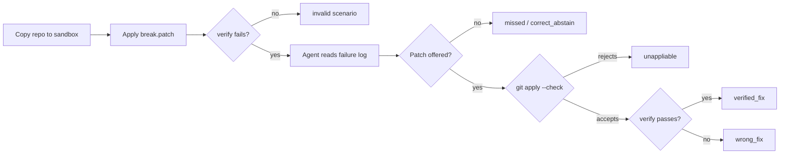

# Failure-agent evals

The failure-analysis agents diagnose a broken build, test or deploy stage and
may open an auto-fix pull request. This harness answers the question a demo
cannot: **how often are they right, and how often would they open a PR that
should never have been opened?**

It seeds known failures into a sandboxed copy of this repo, runs the same agent
classes the pipeline runs, and scores the result with deterministic checks.
No model grades another model.

```bash
pip install -r requirements.txt

python -m evals.run --client oracle              # free; a perfect model, to prove the suite is sound
python -m evals.run --client null                # free; a model that never proposes a fix (the floor)
python -m evals.run --client live --record v1    # real model; needs GEMINI_API_KEY; saves responses
python -m evals.run --client replay --recordings v1   # free re-score of a saved run
python -m pytest evals/tests -q                  # tests for the harness itself
```

Each run writes `evals/results/latest/report.md` and `results.json`, and exits
non-zero if a threshold in `thresholds.json` is missed.

## What a run does



## Outcomes

| Outcome | Meaning | In production |
|---|---|---|
| `verified_fix` | Patch applied and the broken stage passes again | A correct auto-fix PR |
| `correct_abstain` | The failure is not caused by the repo, and no patch was offered | Diagnosis comment only |
| `missed` | Fixable, but no patch offered | Diagnosis comment only |
| `unappliable` | Patch offered, but `git apply` rejects it | No PR; tokens wasted |
| `wrong_fix` | Patch applies but the stage still fails, or it edits a protected path | **A bad auto-fix PR** |
| `false_fix` | Patch applies for a failure no repo change can fix | **A bad auto-fix PR** |
| `agent_error` | The model call failed | Excluded from rates; fails the gate |
| `invalid_scenario` | The scenario no longer matches the repo, or its check fails even on a clean checkout | Fails the gate |

## Metrics

| Metric | Definition |
|---|---|
| `diagnosis_accuracy` | Root cause named correctly, over scenarios scored |
| `verified_fix_rate` | Verified fixes over fixable scenarios |
| `patch_apply_rate` | Patches `git apply` accepts over patches proposed |
| `pr_precision` | Verified fixes over PRs that would have been opened |
| `abstention_accuracy` | Correct abstentions over unfixable scenarios |
| `harmful_pr_rate` | `wrong_fix` + `false_fix` over scenarios scored |
| `cost_per_verified_fix_usd` | Total LLM spend over verified fixes |

`harmful_pr_rate` is the one to watch. A missed fix costs a human a few
minutes; a plausible but wrong PR costs review time and trust.

## Design choices

- **Deterministic grading.** Diagnosis is scored by keyword groups, fixes by
  running the real check. The same response always gets the same score.
- **Fixes are verified, not eyeballed.** A patch counts only if the stage that
  failed passes afterwards.
- **Abstention is scored.** Three scenarios are runner or network failures no
  code change can fix. The right answer there is `NONE`.
- **Gaming the check is a failure.** Each scenario lists protected paths. A
  patch that edits the failing test instead of the bug is a `wrong_fix`.
- **A broken environment is not the agent's fault.** Every check first runs on
  the untouched repo. If it fails there, the scenario is reported as invalid
  instead of being scored as a wrong fix.
- **Ceiling and floor.** `oracle` must score 100% or the suite is broken;
  `null` shows what "do nothing" scores. A real model sits in between.
- **Stale recordings are refused.** A recording is tied to a fingerprint of the
  agent's prompt, so changing a prompt forces a fresh live run.
- **Same code path as production.** The harness calls the pipeline's agent
  classes and applies patches the way `common/git_ops.py` does.

## What the harness found before any model call

1. **A perfect model scored 75%, not 100%.** `FailureBaseAgent._strip_fences`
   called `.strip()` on the patch, which removes a trailing blank context line.
   `git apply` then rejects the patch as corrupt. Two of the eight fixable
   scenarios end on such a line, so the oracle's correct patches are discarded.
   Fixed by trimming only blank lines; the `self-check` CI job now guards against a regression.
2. **The hardcoded Dockerfile fallback never opens a PR.** With a model that
   returns `NONE`, `BuildFailureAgent` falls back to a built-in patch for the
   `nonexistent.txt` demo. Its hunk header is a bare `@@`, so `git apply`
   rejects it (`build-missing-copy-source` scores `unappliable` under `null`).

## Scenarios

Each folder in `scenarios/` holds:

| File | Purpose |
|---|---|
| `break.patch` | Seeds the failure into a clean tree. Absent for unfixable scenarios. |
| `failure_log.txt` | The log the agent sees |
| `scenario.json` | Stage, expected diagnosis keywords, expected and protected files, and the `verify` commands that must pass once fixed |

To add one: break the repo, save `git diff` as `break.patch`, save the stage's
log, and write `scenario.json`. `pytest evals/tests` then checks that the patch
applies, that `verify` fails on the broken tree, and that undoing the break
makes it pass.

## Limits

- Eleven scenarios against a small demo app. Rates from a suite this size are
  directional; use `--trials` and add scenarios from your own incident history.
- Test-stage logs are real pytest captures. Build and deploy logs are written
  to match Docker and `deploy.sh` output, because the verify step has to run
  without Docker. Replace them with logs from real CI runs.
- Keyword grading can pass a vague diagnosis or fail a correct one phrased
  unusually. Read the `root_cause` field in `results.json` when a score surprises you.
- `thresholds.json` holds starting values, not calibrated ones. Set them from
  your first few live runs.
